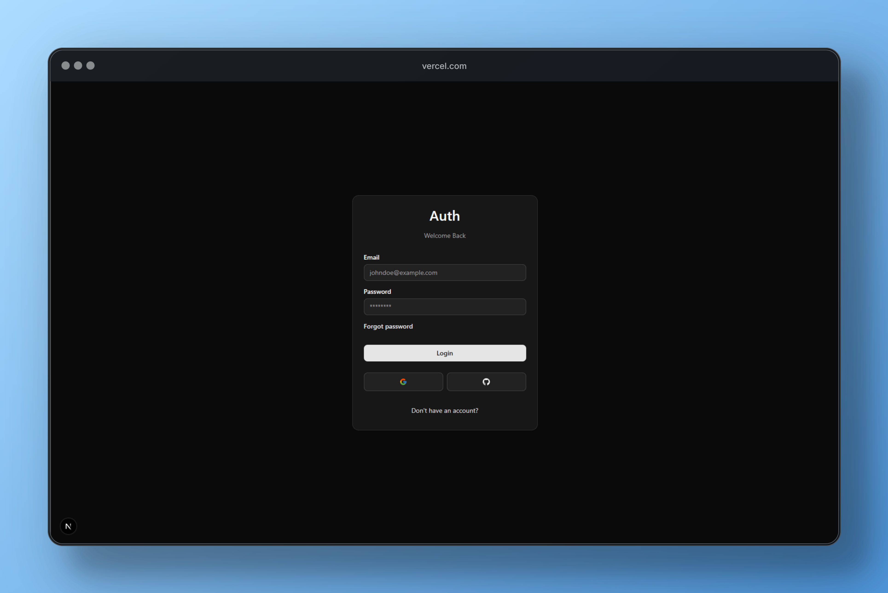
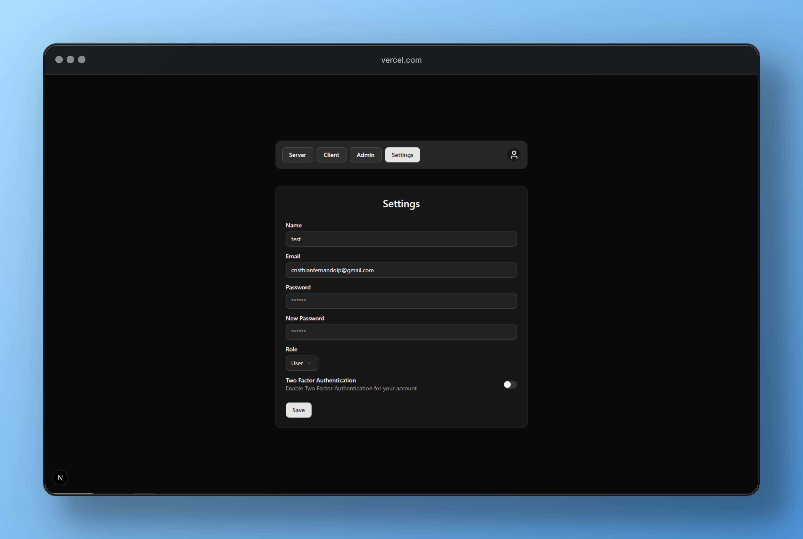
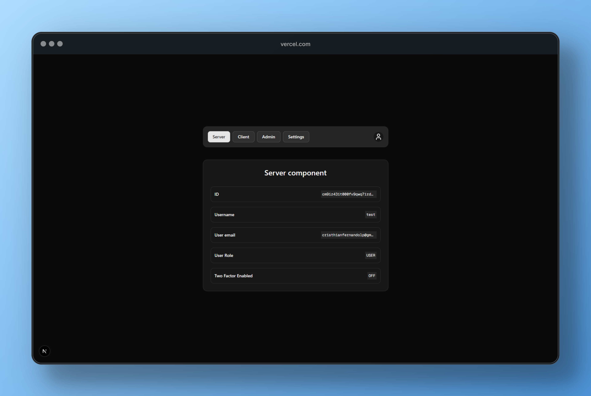

# 🔐 Advanced NextAuth (Auth.js) Template

Este projeto é uma implementação avançada de autenticação utilizando [NextAuth v5 (Auth.js)](https://authjs.dev), com suporte completo para autenticação via credenciais e OAuth, verificação de e-mail, autenticação em dois fatores (2FA), gerenciamento de usuários, proteção de rotas e muito mais — tudo com **Next.js 14**, **Server Actions** e o **Prisma ORM**.

## ⚙️ Tecnologias utilizadas

- [Next.js 14](https://nextjs.org/)
- [Auth.js (NextAuth v5)](https://authjs.dev)
- [Prisma ORM](https://www.prisma.io/)
- [Tailwind CSS](https://tailwindcss.com/)
- [PostgreSQL](https://www.postgresql.org/)
- [React Hook Form](https://react-hook-form.com/)
- [Zod](https://zod.dev/) para validação
- [TypeScript](https://www.typescriptlang.org/)

---

## ✅ Funcionalidades

### 🔐 Autenticação

- Login com **credenciais** (email + senha)
- Login com **OAuth** (Google e GitHub)
- Verificação de e-mail ao registrar
- Recuperação de senha com envio por email
- **Autenticação em dois fatores (2FA)** via email

### 👤 Gerenciamento de usuários

- Registro de novos usuários
- Proteção por **roles**: `admin` e `user`
- Modificação de email com nova verificação
- Alteração de senha com confirmação da senha atual
- Ativação/desativação do 2FA
- Alteração de role (apenas em desenvolvimento)

### 🛡️ Proteção de conteúdo e ações

- Proteção de **rotas e páginas** com middleware
- Proteção de **Server Actions**
- Proteção de **API Routes**
- Gate de acesso para admins (`<RoleGate />`)

### 💻 Componentes e utilitários

- Componentes de Login, Registro, Esqueci a Senha, Verificação, Erros
- Botões prontos de Login e Logout
- Hooks personalizados:
  - `useCurrentUser`
  - `useRole`
- Utilitários:
  - `currentUser()`
  - `currentRole()`

### 🧪 Exemplos

- Exemplos com **Server Components** e **Client Components**
- Sessões estendidas com informações customizadas
- Exploração dos **callbacks do NextAuth**

---

## 📸 Preview





---

## 🧰 Como usar

### 1. Clone o repositório

```bash
git clone https://github.com/cristhian-fs/next-auth-template
cd next-auth-template
```

### 2. Instale as dependências

```bash
npm install
```

### 3. Configure o ambiente
Crie um arquivo `.env` baseado no exemplo `.env.example` com suas credenciais:

```env
DATABASE_URL=
DATABASE_URL_UNPOOLED=
AUTH_SECRET=

GITHUB_CLIENT_ID=
GITHUB_CLIENT_SECRET=
GOOGLE_CLIENT_ID=
GOOGLE_CLIENT_SECRET=

RESEND_API_KEY=
NEXT_PUBLIC_APP_URL=
```

### 4. Configure o Prisma

```bash
npx prisma generate
npx prisma db push
```

### 5. Rode o projeto

```bash
npm run dev
```

## 💡 Créditos

Este projeto foi baseado no guia avançado de NextAuth V5 do [Code with antonio](https://youtu.be/1MTyCvS05V4?si=WF07CGfiVt3McYgm), com ajustes e melhorias próprias para estudo e uso em produção.